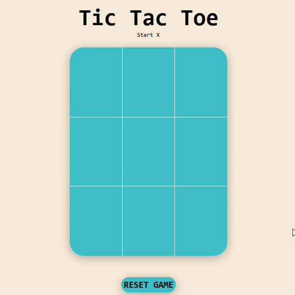
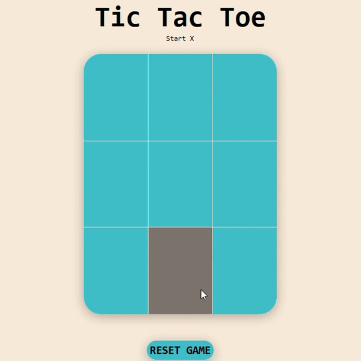

# Projeto Jogo da Velha
A um tempo venho estudando conceitos básicos de Front-end (HTML, CSS, Javascript), e então decidi coloca em pratica esses conhecimentos em um projeto simples e talvez um tanto clichê, mas a ideia de construir um jogo da velha na mão me motivou bastante.

Com certeza tenho muito que melhora ainda na lógica e na organização do código, mas fiquei bastante satisfeito com o resultado, concluir isso foi realmente satisfatório.

Segue umas imagens dele funcionando.

